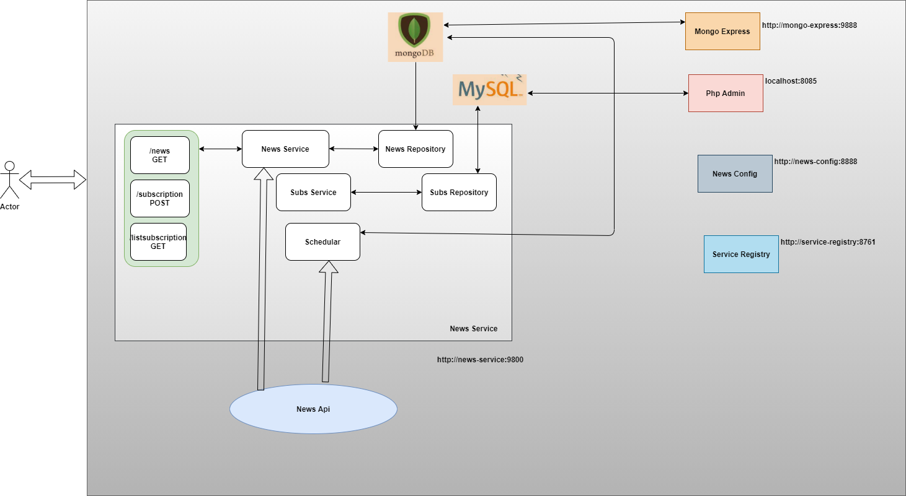

# News Service Application
## Features 
* This offers apis in order to retrieve news of any subject for specified interval in {MIN,HOUR,DAY,WEEK,MONTH,YEAR}

## Dependent Services 
* News-config : this is the config server from where configurations are fetched in run time
* Service-registry : this is the registration server where news service application is registered as a eureka client
* mongo db: this is used to store the news data for the users subscribed topics
* mongo express : this can be used in order to see the documents in mongo db

## Steps to execute
* Get the hold of [docker-compose.yml](https://github.com/Rohit04061992/newsrepo/blob/main/docker-compose.yml) 
* Get all the projects and build their docker images with command "docker build -t news ."

## Working
* User can subscribe for his favourite subjects 
* The moment service finds any active subscription , it starts syncing the data for the same after every 1 min.
* In case any call comes for the same subject , as the database is in consistent state info is retrieved from database and then served appropriately as per the defined bucket
* In case call comes for any subject that is not being subscribed then it is retrieved from the Api.

